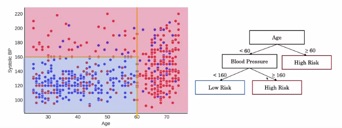
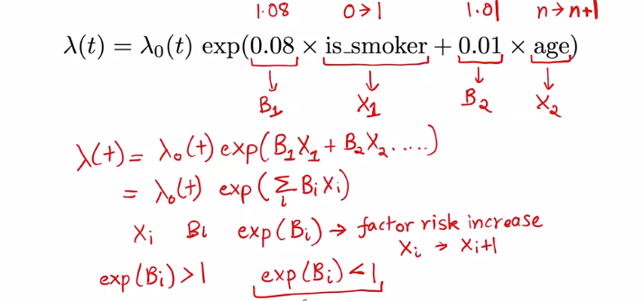

# Coursera: AI for Medical Prognosis
Summarize, assignment (Jupyter notebook), labs (Jupyter Notebook) from the Coursera's AI for Medical Course.


# Table of Contents
- [Coursera: AI for Medical Course](#coursera-ai-for-medical-course)
- [Table of Contents](#table-of-contents)
- [Key Concepts](#key-concepts)
  - [Week 1: Introduction to Medical Prognosis TOC](#week-1-introduction-to-medical-prognosis-toc)
    - [Introduction to Medical Prognosis](#introduction-to-medical-prognosis)
    - [In practice: input / output](#in-practice-input--output)
    - [Example (Regression): Atrial Fibrillation  / Liver Disease Mortality / Risk of Heart Disease](#example-regression-atrial-fibrillation---liver-disease-mortality--risk-of-heart-disease)
    - [Risk Equation: Linear Model / Interaction / Linear in ln()](#risk-equation-linear-model--interaction--linear-in-ln)
    - [Evaluating Prognostic Models: Concordant Pairs, Risk Ties, Permissible Paris](#evaluating-prognostic-models-concordant-pairs-risk-ties-permissible-paris)
    - [C-Index](#c-index)
  - [Week 2: TOC](#week-2-toc)
    - [Decision Trees](#decision-trees)
    - [Missing Data is common in survival data or censored data](#missing-data-is-common-in-survival-data-or-censored-data)
    - [Imputation: Filling in missing values](#imputation-filling-in-missing-values)
  - [Week 3: Survival Model TOC](#week-3-survival-model-toc)
    - [Survival Function: what is the probability of death in t years?](#survival-function-what-is-the-probability-of-death-in-t-years)
    - [Property of Survival Function](#property-of-survival-function)
    - [Survival Data: Censored Data](#survival-data-censored-data)
    - [Right Censoring: time to event is only known to exceed a certain value.](#right-censoring-time-to-event-is-only-known-to-exceed-a-certain-value)
    - [Estimating the survival function](#estimating-the-survival-function)
    - [Estimating Survival using censored data](#estimating-survival-using-censored-data)
    - [Estimating Survival using censored data (Generalized)](#estimating-survival-using-censored-data-generalized)
    - [Kaplan Meier Estimate](#kaplan-meier-estimate)
  - [Week 4: TOC](#week-4-toc)
    - [Survival to Hazard](#survival-to-hazard)
    - [Cumulative Hazard $\Lambda(t)$](#cumulative-hazard-lambdat)
    - [Cox Proportion model: Individualized Prediction](#cox-proportion-model-individualized-prediction)
    - [Survival Tree](#survival-tree)
      - [Example: Given that we have two variables age and bp.](#example-given-that-we-have-two-variables-age-and-bp)
      - [Calculating the subgroup's Hazard function](#calculating-the-subgroups-hazard-function)
      - [Comparing the risk of patients](#comparing-the-risk-of-patients)
      - [Mortality Score: a single value that allow us to compare the risk of patients where it matters.](#mortality-score-a-single-value-that-allow-us-to-compare-the-risk-of-patients-where-it-matters)
      - [Harrell's C-Index to evaluate the model](#harrells-c-index-to-evaluate-the-model)
- [Assignment Overview](#assignment-overview)
  - [Assignment 1: Build and Evaluate a Linear Risk model](#assignment-1-build-and-evaluate-a-linear-risk-model)
  - [Assignment 2: Risk Models Using Tree-based Models](#assignment-2-risk-models-using-tree-based-models)
    - [C-Index Calculation:](#c-index-calculation)
    - [DecisionTree](#decisiontree)
    - [RandomForest](#randomforest)
    - [Missing data](#missing-data)
    - [Imputation:](#imputation)
    - [Model Explanation: SHAP](#model-explanation-shap)
  - [Assignment 3: Survival Estimates that Vary with Time](#assignment-3-survival-estimates-that-vary-with-time)
    - [Naive Survival Estimate:](#naive-survival-estimate)
    - [Kaplan-Meier Estimate](#kaplan-meier-estimate-1)
    - [Comparing survival function between two groups (Log-Rank Test)`KaplanMeierFitter` class from `lifelines`](#comparing-survival-function-between-two-groups-log-rank-testkaplanmeierfitter-class-from-lifelines)
  - [Assignment 4:](#assignment-4)
    - [Cox Proportional Hazards](#cox-proportional-hazards)
    - [Hazard Ratio](#hazard-ratio)
    - [Harrell's C-index](#harrells-c-index)
    - [Random Survival Forests from R package](#random-survival-forests-from-r-package)
- [Labs TOC](#labs-toc)
  - [Lab 1.1: Linear Model using scikit-learn](#lab-11-linear-model-using-scikit-learn)
  - [Lab 1.2: Manual Calculation for Atrial Fibrillation  / Liver Disease Mortality / Risk of Heart Disease](#lab-12-manual-calculation-for-atrial-fibrillation---liver-disease-mortality--risk-of-heart-disease)
  - [Lab 1.3: Combining features in Pandas (Observing the interaction effect)](#lab-13-combining-features-in-pandas-observing-the-interaction-effect)
  - [Lab 1.4: Concordance index](#lab-14-concordance-index)
  - [Lab 2.1: Decision Tree with ScikitLearn / Missing Data / Imputation](#lab-21-decision-tree-with-scikitlearn--missing-data--imputation)
    - [Lab 3.1: Survival function without censored and with censored (Kaplan-Meier)](#lab-31-survival-function-without-censored-and-with-censored-kaplan-meier)


***

# Key Concepts

## Week 1: Introduction to Medical Prognosis [TOC](#table-of-contents)

### Introduction to Medical Prognosis
Medical Prognosis refers to **predicting risk of a future event**, i.e. death, heart attack, specific medical condition, or stroke. It can be used to 
- informing patients:
  - **their risk of developing an illness**, i.e. using the blood test to estimate the risk of developing breast and ovarian cancer, or 
  - **how long they can expect to survive with certain illness**, i.e. survival time for cancer. 
- guiding treatment:
  - Using the model to estimate the risk of heart attach to determine who should get drugs.
  - Using the model to calculate a 6-month mortality risk to determine who should receive end-of-life care. 

### In practice: input / output
- Input: Profile of the patient such as clinical history, physical exam finding (bp, vital sign, temp.), labs (blood count, scan)
- Output: risk score for the patient (arbitrary number or prob.)

    

### Example (Regression): Atrial Fibrillation  / Liver Disease Mortality / Risk of Heart Disease

- Example 1: Atrial Fibrillation is a common abnormal heart rhythm. Create the model that predict the one-year risk of stroke via the "chads vasc" score. Example, calculating the score for the one-year risk of stroke of a 70 year old mal diagnosed with AF has *hypertension* and *diabetes* that is using in the medical practice.
    
    
    
    

- Example 2: Liver Disease Mortality. Calculating the 3-month mortality (MELD) score for the patients >= 12 years old on liver transplant waiting lists. The score is one of the factor that determine how quickly the patient get the transplant.

    
    
    

- Example 3: Estimate the 10-year risk of heart disease.

    
    
    
    $$Rusk = 1 - 0.9533^{e^{Sum-86.61}} = 1 - 0.9533^{e{86.16-86.61}} = 3%$$

### Risk Equation: Linear Model / Interaction / Linear in ln()
- Example of Risk Equation: 
    
- Interaction: Age and BP are dependent with each other. 
    


### Evaluating Prognostic Models: Concordant Pairs, Risk Ties, Permissible Paris
We evaluate how well the prognostic model perform on pair of patients by comparing the risk score. 
    


- Concordant: Risk score is higher for the death outcome. Good prognostic model (+1)

    
- Not Concordant
    
    
- Risk Ties: different outcomes but same risk score. (+0.5)
- Permissible Pairs: when the outcomes of the pair are the same.


### C-Index
  $$ \text{C-index} = \frac{\text{n(concordant pairs)+} 0.5 \times \text{n(risk ties)}}{\text{n(permissible pairs)}}$$
- The c-index measures the discriminatory power of a risk score.
- Intuitively, a higher c-index indicates that the model's prediction is in agreement with the actual outcomes of a pair of patients.
- C-Index interpretation: $$P(score(A) \gt score(B) \ | \  Y_A \gt Y_B)$$ Given that $Y_A \gt Y_B$, i.e. the outcomes of patient A is greater (worse outcome) than patient B, what is the probability that the worse outcome patient (A) has a higher score.
  - random model score = 0.5
  - perfect model score = 1
- Example: 5 patients with 9 pairs.
  
    

***

## Week 2: [TOC](#table-of-contents)

### Decision Trees
Consider the dataset with Age and Systolic BP as the features and a binary 10-year-mortality risk variable as the label (red: die within 10 years, blue: alive after 10 years).
- Linear Model is not a good candidate.
    
- Decision Tree is more suitable. It can captures the non-linear relationship. It can only create the horizontal and vertical decision boundary. The red partition is where there are red dots more than 50% and vice versa for the blue region.
  
Decision tree can easily overfitting the data if we keep training it. We can set the maximum Depth to help prevent this or we can just use the random forest. 
    
- Random Forest: Construct multiple decision tree and average their output. Each tree is built from with the sample from bootstrap sampling and subset of features. 

### Missing Data is common in survival data or censored data

Dropping the missing data in both training and testing set. 


However, dropping the missing data could reduce the number of sample for a certain group which could result in different distribution. Left hand side of the yellow line are off and the model are performing really bad for the patient with age less than 40. It is likely that the clinic doesn't record the BP for younger patient which could lead to the systematic error. We need to watch out for this to prevent the bias.


  
However, in general the missing data could happen completely at Random, i.e. the missingness doesn't depend on anything $p(missing)=constant$ regardless of who you are. This won't create the bias model.

- Missing Completely at Random regardless of who you are. This won't create the bias model.
  
  
  

- Missing at Random (conditional): Note that the missing at random = missingness dependent only on available information. In this case the only available information is `Age` and it is determining what the probability of missingness is.

    
    

- Missing Not at Random: The patient waiting is unobservable in the data. But the missingness depends on the waiting varaible, this could create the bias. 
  
    
    
    

### Imputation: Filling in missing values

Case Study: CVD Event Prediction 


1. Step 1: Splitting training and testing set
2. Exploring the training set. Red: has CVD event in the next 10 years. The vertical dotted line is the missing value of the BP. 
    
3. Imputation:
   1. Mean Imputation: $Mean(BP_{training}) = 140$ for the missing data in both training and testing set. It doesn't care about the relationship between the BP and Age. 

        
   
   2. Regression Imputation:  $BP = \beta_{age} Age + \text{offset}$
   
        


## Week 3: Survival Model [TOC](#table-of-contents)

Survival Model: a model where we care about the time to the occurrence of an event, e.g. time from treatment to recurrence, time from diagnosis to death. 


Previously, we ask "**What is the probability of death in 5 years?**" so we build the model that estimate the probability of death for a patient in 5 years. This is very similar as asking "What is the probability of survival past 5 years?"


### Survival Function: what is the probability of death in t years?
Previously, we would need to build 3 separate models for the patient if we are interested in 3 different time horizon, 1, 5, and 10 years. 


Survival Function: $$S(t) = Pr(T > t)$$
Probability that the time to an event is grater than small t. 


### Property of Survival Function
1. Monotonic Decreasing function: $S(u) \le S(v)$ if $u \ge v$
2.  $$ S(t) =
    \begin{cases}
      -1 & \text{if $t=0$}\\
      -0 & \text{if $t=\infty$}
    \end{cases}   $$
    
    
    


### Survival Data: Censored Data
Before, the label is a binary variable (yes/no)


For the survival model, the label is **"when"** information? E.g. how much time does the time passed between the treatment until they got the stroke (if they have one).


1. First patient have a stroke after 12 months.
2. 2nd patient doesn't have a stroke within the study period. (censoring)
3. 3rd patient: withdraw from the study (censoring)
    


### Right Censoring: time to event is only known to exceed a certain value.
2 types of right censoring: end-of-study or withdraw. For the end-of-study censoring, it is possible that the event occur after the observed period, or the event never occur.


### Estimating the survival function

For now, we will be estimate the survival function for a whole population.


$$S(t) = Pr(T > t) = \frac{\text{n(survived to t months)}}{\text{total num. patients}}$$
1. Assumption 1: everyone who has censor die immediately. `S(25) = 2/7 = 0.29`
2. Assumption 2: everyone who has censor never die. `S(25) = 5/7 = 0.71`

The estimated probability is so much different between these two cases. However, we can assume that the true probability likely lie in-between.


### Estimating Survival using censored data

Recall the definition: How to estimate probability of survival past 25 months with censored observations? Assume T is discrete.
$$\begin{aligned}
S(25) &= P(T\gt 25) = P(T\ge 26) \\
    &= P(T\ge 26 \ \cap T\ge 25 \ \cap ... \cap T \ge 0) \\
    &= P(T \ge 26 | T \ge 25)P(T \ge 25 | T \ge 24) ... P(T \ge 1 | T \ge 0)P(T \ge 0) \\
    &= P(T \gt 25 | T \ge 25)... \\
    &= [1 - P(T=25 | T \ge 25)][1 - P(T=24 | T \ge 24)]...[1 - P(T=1 | T \ge 1)] 
\end{aligned} $$

Recall: 
- $P(A\cap B) = P(A|B)P(B)$ 
- $P(A \cap B \cap C) = P(A|B\cap C)P(B|C)P(C)$
- $P(T \ge 0) = 1$


Basically, if there is no patient die at time J < t (in this case t=25), then the term will be reduce to just (1-0) = 1.  So, only two terms are left (20 and 10).


Comparison between 3 cases: 


### Estimating Survival using censored data (Generalized)


### Kaplan Meier Estimate

The survival function is based on the whole population. However, we can estimate two separate functions and compare them, e.g. Stage III vs Stage IV cancer. 


***

## Week 4: [TOC](#table-of-contents)


### Survival to Hazard
Question: What's a patient's immediate risk of death if they make it to time t? 

Hazard function: $\lambda(t) = Pr(T=t | T \ge t)$


The hazard function can help us answer:
- More at risk in year 1 or year 10?
- Inform Treatment

We can see the risk of the patient, i.e. high at the beginning, not so high in the middle, and high toward the end. This kind of curve is called bathtub curve. This could be an example of surgery case where there is a high risk right after the surgery. 


Relationship between Hazard and Survival. The hazard is a rate of death if aged t
 


### Cumulative Hazard $\Lambda(t)$
What is the patient's accumulated hazard up to time t? 

$\Lambda (t) = \sum_{i=0}^{t} \lambda (i)$  where t = 0,1,2,3,...

$\Lambda (t) = \int_{0}^{t} \lambda (i) \ di$   where t is a continuous variable.


### Cox Proportion model: Individualized Prediction
Previously, hazard function is applied to the whole population. However, each individual has different characteristic (age, smoker?, healthy lifestyle?). We need the individual hazard function.


Similar to the regression model where we have coefficients and variables. The exponential function to ensure that the value is greater than or equal to 0 ($\ge$ 0). 

Note that $\lambda _0 (t) \ge 0$, then $\lambda_1(t) \ge \lambda_2(t)$ which means that the patient 1 has as least as much risk as patient 2 if not higher at anytime point. 


Comparing between smoker vs non-smoker group by fixing the age variable and observing the effect of age on hazard. Risk factor increase by $exp(\beta_{variable})$ per unit increase in a variable.
- $exp(\beta_{variable})$ > 1 :  factor risk increase
- $exp(\beta_{variable})$ < 1 :  factor risk decrease (negative weight)
  




### Survival Tree
Before, the linear model (Proportional Cox model)
- the individual risk is just a factor of the baseline risk. Everyone has the same curve just shifting up and down. 
- It can only captures the linear relationship with the variable. 


#### Example: Given that we have two variables age and bp. 
- The label is the **survival time** for each patient. 
- Base on the dataset, we can roughly classify them into different groups based on their labels.
- The data is a time to event survival data. The output provide the risk level.
- Let say, the patient is 52 years old and has a BP of 132. He will be using the $\Lambda_b(t)$ which is calculated using all the data in group b.
  


#### Calculating the subgroup's Hazard function
We can get the hazard function by calculating the survival function using the Kaplan Meir function.


We can also use the Nelson-Aalen Estimator to calculate the cumulative hazard directly. For example, consider t=33, using the Nelson-Aalen Estimator, we get the estimated cumulative hazard of 0.75.


#### Comparing the risk of patients
1. Step 1: we identify which group they are belonged to. 
2. Step 2: Calculate their cumulative hazard. 

It is possible that their curve could be crossing. so when comparing, we need to ask ourselves at which time that we care about.


#### Mortality Score: a single value that allow us to compare the risk of patients where it matters.
- $M_a = \sum_{\forall t} \Lambda_a(t)$ where t is the event time from the sample (ignored the censoring observation). In this case, we have t = {10,15,30,33}. Here, the risk (cumulative function) is higher in patient a than/for the patients in group c.


#### Harrell's C-Index to evaluate the model
Previously, we use C-index to compare the permissible pairs.


- Concordant: the patient with worse outcome should have higher risk score. 
  - Left patient has a worse outcome because it has an event earlier (live shorter) so it should have the higher risk score.

    

  - Same outcome, they should have the same score.
    
    

- Risk Ties: Same risk score but different outcome or same time of event but different risk score.


- Permissible Pairs: unlike the non-survival data. Having the same T is still a permissible pair in survival data. 
    
    
    
    We can see that B is out-lived A.

    

    Here, we don't if A eventually out-live B or not. 

    

    We can't make any comparison if both of them are censored. 

    

- Harrell's C-index:


Example of Harrell's C-Index
- The risk score can come from the risk factor (Cox proportional hazard model) or from the Mortality score (survival tree). 


***
***

# Assignment Overview

## Assignment 1: Build and Evaluate a Linear Risk model
- Unskewed and Normalize the data:
    ```python
    # Remove skew by applying the log function to the train set, and to the test set
    df_train_unskewed = np.log(df_train)
    df_test_unskewed = np.log(df_test)

    #calculate the mean and standard deviation of the training set
    mean = df_train_unskewed.mean(axis=0)
    stdev = df_test_unskewed.mean(axis=1)

    # standardize the training set
    df_train_standardized = (df_train_unskewed - mean) / stdev

    # standardize the test set 
    df_test_standardized = (df_test_unskewed - mean) / stdev
    ```
- Logistic Regression
- Evaluate the model using the C-Index based on the score (estimated probability from the logit model)
- "Add interaction" function
- Feature Importances (Logistic Regression's Coefficient)
    ```python
    int_coeffs = pd.DataFrame(data = model_X_int.coef_, columns = X_train_int.columns)
    int_coeffs.T.plot.bar();
    ```

## Assignment 2: Risk Models Using Tree-based Models
- Missing Value
    ```python
    sns.heatmap(X_train.isnull(), cbar=False)
    plt.title("Training")
    plt.show()

    ### Percentage of row with any missing data
    missing_perct = len(df[df.isnull().any(axis=1)]) / len(df)
    ```
    

### C-Index Calculation:
See the utility function
$$\text{C-Index} = \frac{\#\text{concordant pairs} + 0.5\times \#\text{ties}}{\#\text{permissible pairs}}$$

### DecisionTree
```python
dt_hyperparams = { 'max_depth' : 4 }
dt_reg = DecisionTreeClassifier(**dt_hyperparams, random_state=10)
dt_reg.fit(X_train_dropped, y_train_dropped)

dot_data = StringIO()
export_graphviz(dt_reg
            , feature_names=X_train_dropped.columns
            , out_file=dot_data, filled=True, rounded=True
            , proportion=True, special_characters=True
            , impurity=False, class_names=['neg', 'pos'], precision=2)
graph = pydotplus.graph_from_dot_data(dot_data.getvalue())  
Image(graph.create_png())
```


### RandomForest
- Parameter Tuning: n_estimators / max_depth / min_samples_leaf

### Missing data
Visualizing the missing data to ensure the distribution is still the same after dropping the missing data.

- Missing at Random (MAR): As missingness is related to one or more covariates. Eg. Age
    
    

- Missing Completely at Random (MCAR): the covariates are distributed similarly whether or not we have discarded rows with missing data.

    

### Imputation:
- Mean:
    ```python
    # Impute values using the mean
    imputer = SimpleImputer(strategy='mean')
    imputer.fit(X_train)
    X_train_mean_imputed = pd.DataFrame(imputer.transform(X_train), columns=X_train.columns)
    X_val_mean_imputed = pd.DataFrame(imputer.transform(X_val), columns=X_val.columns)
    ```
- Regress on other covariates:
  ```python
  # Impute using regression on other covariates
  imputer = IterativeImputer(random_state=0, sample_posterior=False, max_iter=1, min_value=0)
  imputer.fit(X_train)
  X_train_imputed = pd.DataFrame(imputer.transform(X_train), columns=X_train.columns)
  X_val_imputed = pd.DataFrame(imputer.transform(X_val), columns=X_val.columns)
  ```

### Model Explanation: SHAP
SHAP (SHapley Additive exPlanations): a method that explains predictions made by black-box machine learning models. SHAP values explain the prediction by quantifying the additive importance of each feature to the prediction. SHAP values have their roots in cooperative game theory, where Shapley values are used to quantify the contribution of each player to the game.
  
```python
explainer = shap.TreeExplainer(rf_imputed)
i = 0
shap_value = explainer.shap_values(X_test.loc[X_test_risk.index[i], :])[1]
shap.force_plot(explainer.expected_value[1], shap_value, feature_names=X_test.columns, matplotlib=True)
```


- How to read this chart:
  - The red sections on the left are features which push the model towards the final prediction in the positive direction (i.e. a higher Age increases the predicted risk).
  - The blue sections on the right are features that push the model towards the final prediction in the negative direction (if an increase in a feature leads to a lower risk, it will be shown in blue).

- SHAP Summary Plot: a summary plot of the SHAP values for each feature on each of the test examples
    ```python
    shap_values = shap.TreeExplainer(rf_imputed).shap_values(X_test)[1]
    shap.summary_plot(shap_values, X_test)
    ```
    

    Clearly we see that being a woman (sex = 2.0, as opposed to men for which sex = 1.0) has a negative SHAP value, meaning that it reduces the risk of dying within 10 years. High age and high systolic blood pressure have positive SHAP values, and are therefore related to increased mortality.

- SHAP Dependence Plot: see how features interact using dependence plots. These plot the SHAP value for a given feature for each data point, and color the points in using the value for another feature.
`shap.dependence_plot('Age', shap_values, X_test, interaction_index='Sex')`

    

    We see that while Age > 50 is generally bad (positive SHAP value), being a woman generally reduces the impact of age.

    

    We see that the impact of poverty index drops off quickly, and for higher income individuals age begins to explain much of variation in the impact of poverty index.

## Assignment 3: Survival Estimates that Vary with Time
- Number of censored data
### Naive Survival Estimate: 
Divide the number of people who we know lived past time  𝑡  by the number of people who were not censored before  𝑡 .
  $$ \hat{S}(t) = \frac{|X_t|}{|M_t|} $$
  

### Kaplan-Meier Estimate
Computes the Kaplan Meier estimate of $S(t)$ at every distinct time in the dataset. 

Recall the Kaplan-Meier estimate:

$$
S(t) = \prod_{t_i \leq t} (1 - \frac{d_i}{n_i})
$$

where $t_i$ are the events observed in the dataset and $d_i$ is the number of deaths at time $t_i$ and $n_i$ is the number of people who we know have survived up to time $t_i$.


### Comparing survival function between two groups (Log-Rank Test)`KaplanMeierFitter` class from `lifelines`
```python
S1 = data[data.Stage_group == 1]
km1 = KM()
km1.fit(S1.loc[:, 'Time'], event_observed = S1.loc[:, 'Event'], label = 'Stage III')

S2 = data[data.Stage_group == 2]
km2 = KM()
km2.fit(S2.loc[:, "Time"], event_observed = S2.loc[:, 'Event'], label = 'Stage IV')

ax = km1.plot(ci_show=False)
km2.plot(ax = ax, ci_show=False)
plt.xlabel('time')
plt.ylabel('Survival probability estimate')
plt.savefig('two_km_curves', dpi=300)
```


```python
def logrank_p_value(group_1_data, group_2_data):
    result = logrank_test(group_1_data.Time, group_2_data.Time,
                          group_1_data.Event, group_2_data.Event)
    return result.p_value

logrank_p_value(S1, S2)
```
A p value of less than `0.05`, which indicates that the difference in the curves is indeed statistically significant.

***

## Assignment 4:

### Cox Proportional Hazards
$\lambda(t, x) = \lambda_0(t)e^{\theta^T X_i}$

  - Fitting and Interpreting a Cox Model: 
    ```python
    cph = CoxPHFitter()
    cph.fit(one_hot_train, duration_col = 'time', event_col = 'status', step_size=0.1)
    cph.plot_covariate_groups('trt', values=[0, 1]);
    ```
    


  - Categorical Variable: `one_hot_df = pd.get_dummies(dataframe, columns = columns, drop_first = True, dtype=np.float64)

### Hazard Ratio
Recall from the lecture videos that the Hazard Ratio between two patients was the likelihood of one patient (e.g smoker) being more at risk than the other (e.g non-smoker).
$$
\frac{\lambda_{smoker}(t)}{\lambda_{nonsmoker}(t)} = e^{\theta (X_{smoker} - X_{nonsmoker})^T}
$$

Where

$$
\lambda_{smoker}(t) = \lambda_0(t)e^{\theta X_{smoker}^T}
$$
and
$$
\lambda_{nonsmoker}(t) = \lambda_0(t)e^{\theta X_{nonsmoker}^T} \\
$$

### Harrell's C-index
To evaluate how good our model is performing, we will write our own version of the C-index. Similar to the week 1 case, C-index in the survival context is the probability that, given a randomly selected pair of individuals, the one who died sooner has a higher risk score

### Random Survival Forests from R package
This performed well, but you have a hunch you can squeeze out better performance by using a machine learning approach. You decide to use a Random Survival Forest. To do this, you can use the RandomForestSRC package in R. To call R function from Python, we'll use the r2py package. Run the following cell to import the necessary requirements.

```python
%load_ext rpy2.ipython
%R require(ggplot2)

from rpy2.robjects.packages import importr
# import R's "base" package
base = importr('base')

# import R's "utils" package
utils = importr('utils')

# import rpy2's package module
import rpy2.robjects.packages as rpackages

forest = rpackages.importr('randomForestSRC', lib_loc='R')

from rpy2 import robjects as ro
R = ro.r

from rpy2.robjects import pandas2ri
pandas2ri.activate()

### Fitting the forest
model = forest.rfsrc(ro.Formula('Surv(time, status) ~ .'), data=df_train, ntree=300, nodedepth=5, seed=-1)

### Interpretation
vimps = np.array(forest.vimp(model).rx('importance')[0])

y = np.arange(len(vimps))
plt.barh(y, np.abs(vimps))
plt.yticks(y, df_train.drop(['time', 'status'], axis=1).columns)
plt.title("VIMP (absolute value)")
plt.show()
```


***
***

# Labs [TOC](#table-of-contents)

## Lab 1.1: Linear Model using scikit-learn
Practice using a scikit-learn model for linear regression

## Lab 1.2: Manual Calculation for Atrial Fibrillation  / Liver Disease Mortality / Risk of Heart Disease

## Lab 1.3: Combining features in Pandas (Observing the interaction effect)

## Lab 1.4: Concordance index

## Lab 2.1: Decision Tree with ScikitLearn / Missing Data / Imputation
```python
### Decision Tree
tree_parameters = {'criterion': 'entropy',
                   'max_depth': 10,
                   'min_samples_split': 2
                  }
dt = DecisionTreeClassifier(**tree_parameters)
```


```python
### Mean Imputation
from sklearn.impute import SimpleImputer
mean_imputer = SimpleImputer(missing_values=np.NaN, strategy='mean')
mean_imputer.fit(df)
nparray_imputed_mean = mean_imputer.transform(df)

### Regression Imputation
from sklearn.experimental import enable_iterative_imputer
from sklearn.impute import IterativeImputer
reg_imputer = IterativeImputer()
reg_imputer.fit(df)
nparray_imputed_reg = reg_imputer.transform(df)
```

### Lab 3.1: Survival function without censored and with censored (Kaplan-Meier)
